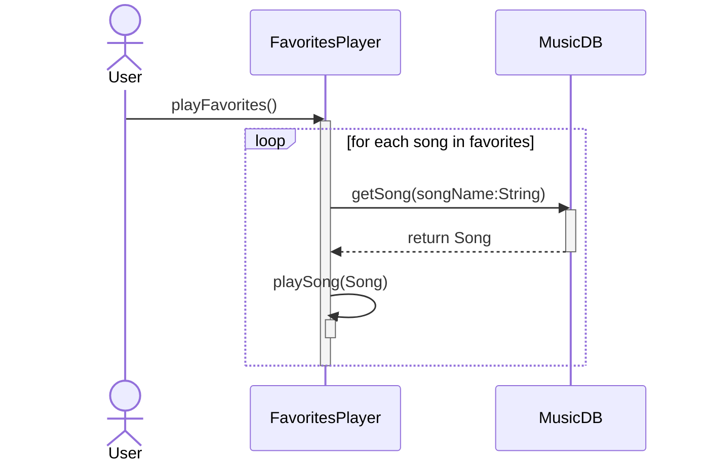

    sequenceDiagram
    participant FavoritesPlayer
    participant MusicDB

    Note over FavoritesPlayer: playFavorites()
    activate FavoritesPlayer
    FavoritesPlayer->>FavoritesPlayer: playSongs(favorites)
    activate FavoritesPlayer

    loop for each song in favorites
        FavoritesPlayer->>MusicDB: getSong(String)
        activate MusicDB
        MusicDB-->>FavoritesPlayer: return Song
        deactivate MusicDB
        
        FavoritesPlayer->>FavoritesPlayer: playSong(Song)
        activate FavoritesPlayer
        deactivate FavoritesPlayer
    end
    deactivate FavoritesPlayer
    deactivate FavoritesPlayer

### Talkshow
[notes](./notes.md)
[startup](https://startup.talkshow.click)
[AWS](https://us-east-1.console.aws.amazon.com/console/home?region=us-east-1)

# Elavator Pitch
Have you ever found yourself at a loss for what to talk about, or just wanted to know how to get to know poeple? Well, fear not, this talkshow application will help you ask the questions that will make your conversation awesome! Talkshow will show a list of questions, allow you to add your own, as well as rate questions. You also might be able to record answers to questions for your future self to reminise. And all this is avaliabe on any internet connecting device!

# Key Features
- secure login over HTTPS
- question reccomendation
- question database
- ability to add questions
- rating for questions
- ability to store answers
- call Chat GTP's API to recommend questions

# Technology
I am going to use the required technologies in the following ways.

- __HTML__ - Uses correct HTML structure for application. Three HTML pages. One for login; one to display questions with the ability to rate, answer, and doesn't show questions recently viewed; and then one to show questions when not logged in with only the ability to see questions. Hyperlinks to choice artifact.
- __CSS__ - Application styling that looks good on different screen sizes, uses good whitespace, color choice and contrast.
- __JavaScript__ - Provides login, questions, ratings, and your answers.
- __Service__ - Backend service with endpoints for:
     - login
     - retrieving questions and ratings
     - submitting ratings
     - sumbitting and retriving answers
- __DB/Login__ - Store users, questions, answers, and ratings in database. Register and login users. Credentials securely stored in database. Can't rate or answer questions unless authenticated.
- __WebSocket__ - New questions will be broadcast to all users.
- __React__ - Application ported to use the React web framework.

# Design
The questions button will reload the questions. The stars will be clickable only when logged in. The A on the logged in screen will allow you to enter you answer. You can create a new question by clicking the plus.

[Figma design](https://www.figma.com/file/Fg6VrxrCSE1NohcuVY39gn/Talkshow?type=design&node-id=0%3A1&mode=design&t=OaUyk8pHjRbHTPUX-1)

# HTML deliverable
For this deliverable I built out the structure of my application using HTML.

- __HTML__ has two pages for authentication and for the questions.
- __HTML tags__ used different tags including BODY, NAV, MAIN, HEADER, and FOOTER.
- __Links__ if user wants to go back to login
- __Textual content__ Has where it shows top questions
- __3rd party service calls__ Calls chatGPT for help making questions.
- __Images__ Shows a thumbs up image to encourage users.
- __Login__ On login page, shows user name at the top of the questions page
- __Database__ Questions and rating stored stored in the database
- __WebSocket__ Shows new questions at bottom of questions page

# CSS delivarables

- [x] done **Prerequisite**: Simon CSS is deployed to [simon.talkshow.click](https://simon.talkshow.click/)
- [x] done **Prerequisite**: A link to this GitHub startup repository is displayed at the bottom left of my application's home page
- [x] done **Prerequisite**: These notes in this startup Git repository README.md file documenting what I modified and added with this deliverable
- [x] done **Prerequisite**: At least 10 git commits spread consistently throughout the assignment period.
- [x] done Properly styled CSS
- [x] done Header, footer, and main content body is present
- [x] done Navigation elements is present
- [x] done Responsive to window resizing is present
- [x] done Application accordion is present 
- [x] done Application text content showing questions are present
- [x] done Application image is present in title and web page

# JS delivarables
- [x] done Prerequisite: Simon JavaScript deployed to my production environment
- [x] done Prerequisite: A link to your GitHub startup repository prominently displayed on my application's home page
- [x] done Prerequisite: These notes in your startup Git repository README.md file documenting what I modified and added with this deliverable
- [x] done Prerequisite: At least 10 git commits spread throughout the assignment period
- [x] done Significant use of JavaScript to create a viable working application
- [x] done 20% JavaScript support for future login on login.js
- [x] done 20% JavaScript support for future database data on login.js and questions.js
- [x] done 20% JavaScript support for future WebSocket on latest quesions
- [x] done 40% JavaScript support for your application's interaction logic on questions.js

# Server delivarables
- [x] done Prerequisite: Simon Service deployed to your production environment
- [x] done Prerequisite: A link to your GitHub startup repository prominently displayed on your application's home page
- [x] done Prerequisite: These notes documenting what I modified and added with this deliverable
- [x] done Prerequisite: At least 10 git commits spread consistently throughout the assignment period.
- [x] done Backend web service support and interaction
- [x] done 40% - Create an HTTP service using Node.js and Express
- [x] done 10% - Frontend served up using Express static middleware in public directory
- [x] done 10% - Your frontend calls third party service endpoints: picture on questions page, also chatGPT but that's on the backend
- [x] done 20% - Your backend provides service endpoints like /questions that gets all the questions
- [x] done 20% - Your frontend calls your service endpoints in loadQuestions() which gets a list of questions

## DB/Login deliverable

For this deliverable I associate the questions with the logged in user. I stored the questions in the database.

- **MongoDB Atlas database created** - data is being stored in MongoDB Atlas
- **Stores data in MongoDB** - When I restart the server, the data is still there
- **User registration** - Creates a new account in the database is there is no account with that username, else check that the password matches, everything is hashed with bcrypt
- **existing user** - Stores the questions under the same user if the user already exists, or loggs you into the guest account if you click guest
- **Use MongoDB to store credentials** - Stores both user and their questions.
- **Restricts functionality** - You cannot get questions beside the default questio.
ns, send questions, or ask chatGPT anything until you have logged in with the correct password. It will send you to the login page if you try to send questions
## WebSocket deliverable

For this deliverable I used webSocket to show the newest questions on the frontend in realtime.

- **Backend listens for WebSocket connection** - done! in newQuestionsProxy.js
- **Frontend makes WebSocket connection** - done! in configureWebSocket() in questions.js
- **Data sent over WebSocket connection** - done! the latest question, as in s3 in getNewestQuestions() in question.js
- **WebSocket data displayed** - s3 question displayed

## React deliverable

For this deliverable I converted the application over to use Vite/React

- [x] **Bundled and transpiled** - done
- [x] **Components** - authentication and questions are components
- [x] **Router** - Routing between login and question components.
- [x] **Hooks** - tracks the username.
